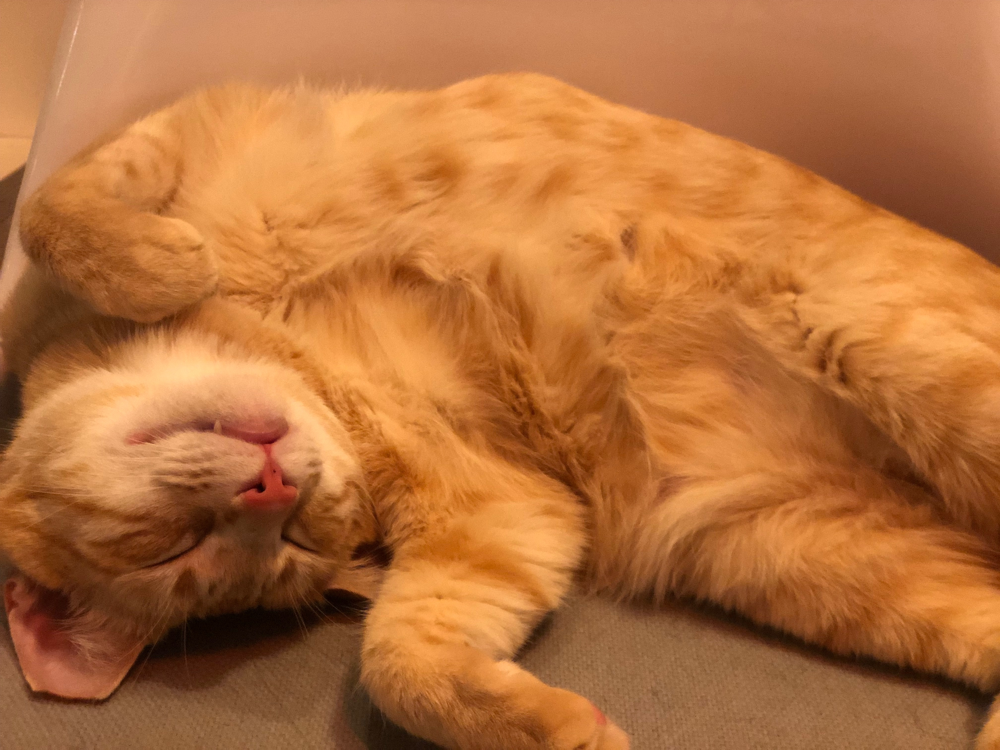

Passionate about the intersection of products and businesses with data science and functional design.
I'm currently working with Platforms Data Science team at Uber in San Francisco.   
On the side I love researching urban policy in the developing world, playing the piano, and fiddling with Abelton Live.   

You can follow my [blog](https://medium.com/shallow-learnings/) for some musings on the these topics, I also semi rant on my [Twitter](https://twitter.com/ravitshrivastav).

<blockquote class="twitter-tweet" data-cards="hidden" data-lang="en">
Just published: Duo, A Simple Jekyll Theme.  <a href="https://t.co/G2kffR9e4U">https://t.co/G2kffR9e4U</a> <a href="https://twitter.com/jekyllrb?ref_src=twsrc%5Etfw">@jekyllrb</a>
&mdash; Shu Uesugi (@chibicode) <a href="https://twitter.com/chibicode/status/923156795824128000?ref_src=twsrc%5Etfw">October 25, 2017</a></blockquote>
